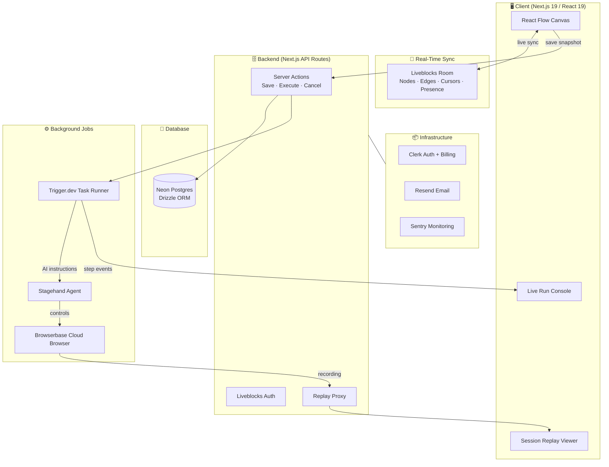
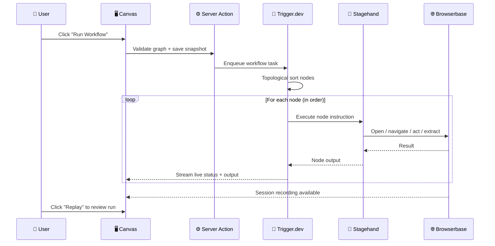
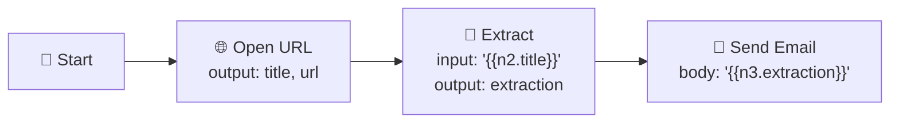
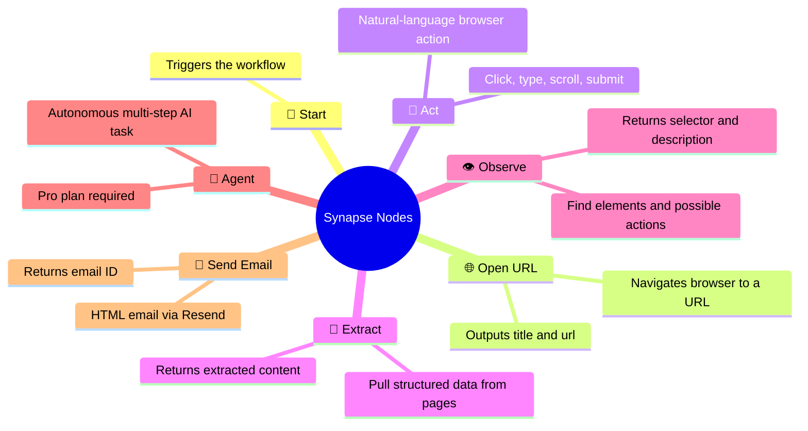
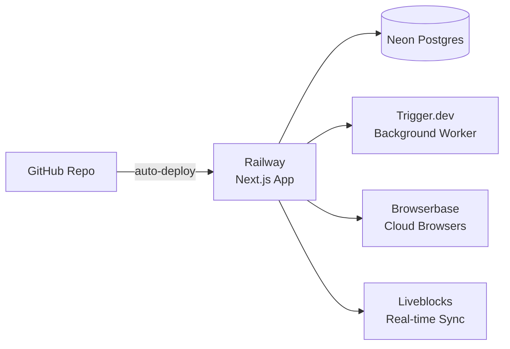
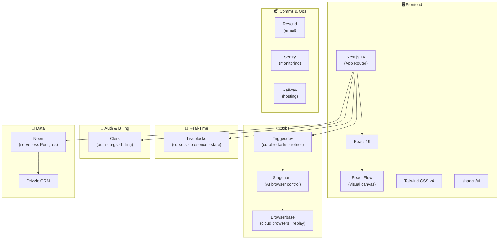

<div align="center">

<br />

# 🧠 Synapse

### **Design in real time. Execute in cloud browsers. Replay every run.**

*A full-stack SaaS platform for building, running, and collaborating on AI-powered browser automations — visually.*

<br />

[](https://nextjs.org)
[](https://react.dev)
[](https://typescriptlang.org)
[](https://tailwindcss.com)

<br />

[](https://browserbase.com)
[](https://trigger.dev)
[](https://liveblocks.io)
[](https://neon.tech)
[](https://clerk.com)
[](https://sentry.io)
[](https://railway.app)

<br />

[Features](#-features) &nbsp;·&nbsp; [Architecture](#-architecture) &nbsp;·&nbsp; [Workflow Nodes](#-workflow-nodes) &nbsp;·&nbsp; [Getting Started](#-getting-started) &nbsp;·&nbsp; [Deploy](#-deploy-on-railway) &nbsp;·&nbsp; [Stack](#-tech-stack)

</div>

---

## 💡 What is Synapse?

Synapse is a **collaborative, no-code browser automation SaaS** that lets teams visually build automation workflows on a shared canvas, execute them inside real cloud browsers using AI, and watch every step run in real time.

```
 User types an instruction  →  AI understands it  →  Real browser executes it  →  You watch it live
```

Think of it as a **visual programming environment for the web** — where each node is a browser action, and the canvas is your automation logic.

---

## ✨ Features

| | Feature | Description |
|---|---|---|
| 🎨 | **Visual Workflow Canvas** | Drag-and-drop React Flow nodes to compose automations without writing scripts |
| 🤝 | **Real-Time Collaboration** | Multiple users edit the same canvas simultaneously with live cursors and presence |
| 🤖 | **AI Browser Control** | Natural-language instructions power real browser actions via Stagehand |
| 🔗 | **Data Passthrough** | Chain nodes with `{{ nodeId.field }}` expressions to pass outputs downstream |
| ⚡ | **Durable Execution** | Long-running jobs with automatic retries, cancellation, and fault tolerance |
| 📺 | **Live Run Console** | Watch each node's status, timing, and output stream in real time |
| 🎬 | **Session Replay** | Rewind and replay the full browser recording after every run |
| 🏢 | **Multi-Tenant Workspaces** | Every organization gets its own isolated workflows and collaboration rooms |
| 💳 | **SaaS Billing** | Clerk Billing gates Pro features like Agent nodes and session replay |
| 🔍 | **Error Monitoring** | Sentry captures frontend, server, edge, and background task errors |

---

## 🏗️ Architecture

### System Overview



### Execution Flow



### Data Flow Between Nodes



Outputs from any node are stored by node ID and injected into downstream inputs using `{{ nodeId.field }}` template expressions — enabling complex multi-step data pipelines with no code.

---

## 🧩 Workflow Nodes



| Node | What it does | Key Outputs |
|------|-------------|-------------|
| **Start** | Entry point — triggers the workflow | — |
| **Open URL** | Navigates the cloud browser to any URL | `url`, `title` |
| **Act** | Executes a natural-language action on the page | `success`, `message`, `url` |
| **Extract** | Pulls structured content from the page via AI | `extraction` |
| **Observe** | Identifies elements and actions available on screen | `selector`, `description`, `matches` |
| **Agent** | Runs a fully autonomous multi-step browser task *(Pro)* | `success`, `completed`, `message` |
| **Send Email** | Sends a rich HTML email via Resend | `emailId` |

---

## 🚀 Getting Started

### Prerequisites

- Node.js 18+ and npm
- [Clerk](https://clerk.com) — Auth + Organizations + Billing
- [Neon](https://neon.tech) — Serverless Postgres
- [Trigger.dev](https://trigger.dev) — Background job runner
- [Liveblocks](https://liveblocks.io) — Real-time collaboration
- [Browserbase](https://browserbase.com) — Managed cloud browsers
- [Resend](https://resend.com) — Transactional email
- [Sentry](https://sentry.io) *(optional)* — Error monitoring

### 1. Clone and install

```bash
git clone <your-repo-url>
cd synapse
npm install
```

### 2. Configure environment

```bash
cp .env.example .env.local
```

```bash
# Clerk
NEXT_PUBLIC_CLERK_SIGN_IN_URL=/sign-in
NEXT_PUBLIC_CLERK_SIGN_UP_URL=/sign-up
NEXT_PUBLIC_CLERK_SIGN_IN_FALLBACK_REDIRECT_URL=/
NEXT_PUBLIC_CLERK_SIGN_UP_FALLBACK_REDIRECT_URL=/
NEXT_PUBLIC_CLERK_PUBLISHABLE_KEY=
CLERK_SECRET_KEY=

# Neon Postgres
NEON_BRANCH=main
DATABASE_URL=
DATABASE_URL_UNPOOLED=

# Trigger.dev
TRIGGER_SECRET_KEY=

# Liveblocks
NEXT_PUBLIC_LIVEBLOCKS_PUBLIC_KEY=
LIVEBLOCKS_SECRET_KEY=

# Browserbase + Resend
BROWSERBASE_API_KEY=
RESEND_API_KEY=

# Sentry (optional)
NEXT_PUBLIC_SENTRY_DSN=
SENTRY_DSN=
SENTRY_AUTH_TOKEN=
```

### 3. Configure Clerk

Enable **Organizations** in your Clerk dashboard — every workflow is scoped to an organization. For Pro features (Agent node, session replay), create a Clerk Billing plan with the slug `pro`.

### 4. Set up the database

```bash
npm run db:generate   # generate Drizzle migrations
npm run db:migrate    # apply to Neon
```

### 5. Start the Trigger.dev worker

```bash
npx trigger.dev dev   # run in a separate terminal
```

### 6. Run the app

```bash
npm run dev
```

Visit [http://localhost:3000](http://localhost:3000), sign in, create an organization, and build your first automation. 🎉

---

## 🚢 Deploy on Railway



### Steps

| Step | Action |
|------|--------|
| 1 | Push repo to GitHub and create a Railway project |
| 2 | Choose **Deploy from GitHub repo** — Railpack auto-detects Node.js |
| 3 | Copy all `.env.local` values into Railway service variables |
| 4 | Run `npm run db:migrate` against the production database |
| 5 | Run `npx trigger.dev deploy` to register the workflow task |
| 6 | Add your Railway domain to Clerk's allowed origins |

> **Build:** `npm run build` &nbsp;|&nbsp; **Start:** `npm start`

---

## 📁 Project Structure

```text
synapse/
│
├── app/
│   ├── (auth)/              # Sign-in, sign-up, org selection (Clerk)
│   ├── (dashboard)/         # Workflow dashboard, editor, billing
│   └── api/
│       ├── liveblocks/      # Liveblocks auth + user resolution
│       └── replays/         # Browserbase session recording proxy
│
├── components/
│   ├── app-sidebar.tsx      # Organization and workflow navigation
│   └── ui/                  # Shared UI primitives (shadcn/ui)
│
├── features/
│   └── workflows/
│       ├── components/      # Canvas, toolbar, inspector, console, replay
│       ├── hooks/           # Billing plan + graph connection hooks
│       ├── lib/             # Validation, interpolation, graph utilities
│       ├── nodes/           # Node registry + executor implementations
│       ├── tasks/           # Trigger.dev workflow task definitions
│       ├── actions.ts       # Server actions: save, run, cancel
│       └── data.ts          # Organization-scoped DB queries
│
└── lib/
    ├── db/                  # Drizzle schema, Neon client, migrations
    ├── browserbase.ts       # Browserbase SDK client
    ├── liveblocks.ts        # Liveblocks server client
    └── resend.ts            # Resend email client
```

---

## 🛠️ Scripts

| Command | Description |
|---------|-------------|
| `npm run dev` | Start Next.js dev server |
| `npm run build` | Production build |
| `npm start` | Start production server |
| `npm run lint` | Run ESLint |
| `npm run format` | Prettier format (TS/TSX) |
| `npm run typecheck` | TypeScript type check |
| `npm run db:generate` | Generate Drizzle migrations |
| `npm run db:migrate` | Apply migrations to Neon |
| `npm run db:push` | Push schema directly (prototyping) |
| `npm run db:studio` | Open Drizzle Studio |

---

## 🧰 Tech Stack



| Layer | Technology | Role |
|-------|-----------|------|
| **Framework** | Next.js 16 + React 19 | Full-stack app with App Router and Server Actions |
| **Canvas** | React Flow | Visual drag-and-drop workflow editor |
| **Collaboration** | Liveblocks | Shared canvas state, live cursors, and user presence |
| **Jobs** | Trigger.dev | Durable background execution with retries and cancellation |
| **AI Automation** | Stagehand | Natural-language browser control and autonomous agents |
| **Browser Runtime** | Browserbase | Managed cloud browsers, model gateway, session recordings |
| **Auth** | Clerk | Authentication, organizations, and subscription gating |
| **Database** | Neon + Drizzle | Serverless Postgres with type-safe queries |
| **Email** | Resend | Transactional email from workflow nodes |
| **Monitoring** | Sentry | Full-stack error and performance tracking |
| **Hosting** | Railway | Zero-config deployment from GitHub |

---

<div align="center">

**Built with ❤️ using Next.js, Stagehand, Trigger.dev, and Liveblocks**

</div>
